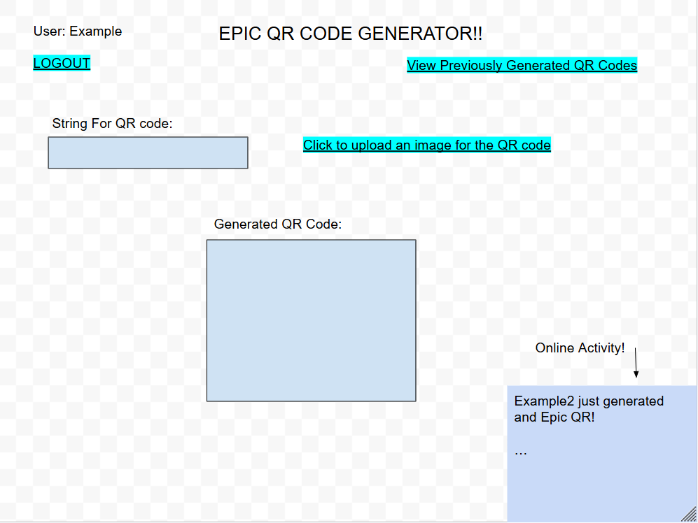
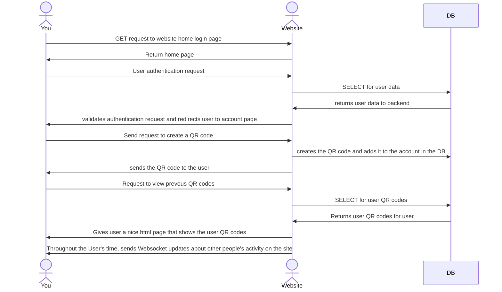

# The Epic QR Generator

[My Notes](notes.md)

This is a QR code generator that will let you put your own logo in the center!

> [!NOTE]
>  This is a template for your startup application. You must modify this `README.md` file for each phase of your development. You only need to fill in the section for each deliverable when that deliverable is submitted in Canvas. Without completing the section for a deliverable, the TA will not know what to look for when grading your submission. Feel free to add additional information to each deliverable description, but make sure you at least have the list of rubric items and a description of what you did for each item.

> [!NOTE]
>  If you are not familiar with Markdown then you should review the [documentation](https://docs.github.com/en/get-started/writing-on-github/getting-started-with-writing-and-formatting-on-github/basic-writing-and-formatting-syntax) before continuing.

## 🚀 Specification Deliverable

> [!NOTE]
>  Fill in this sections as the submission artifact for this deliverable. You can refer to this [example](https://github.com/webprogramming260/startup-example/blob/main/README.md) for inspiration.

For this deliverable I did the following. I checked the box `[x]` and added a description for things I completed.

- [x] Proper use of Markdown
- [x] A concise and compelling elevator pitch
- [x] Description of key features
- [x] Description of how you will use each technology
- [x] One or more rough sketches of your application. Images must be embedded in this file using Markdown image references.

### Elevator pitch

Have you ever wanted to generate a QR code with your own personal logo in the middle?? Well now you can! With the new state of the art Epic QR Generator, you can upload you QR code and your logo and let the generator work the magic! The best part is that when you sign up with us, you'll be able to save your different QR codes for future use! No need to be regenerating those codes constantly!

### Design

As you can see. After the user logs in they have the option to generate a QR code by inserting a string and uploading an image file. There's also the option for them to logout and look at their history of past generate QR codes. On the bottom right a websocket connection will give the user a live feed of other users after they generate QR codes.

### Key features

- Ability to generate a QR code
- Ability to have that QR code with your logo
- Saves past QR codes that you have made on your account
- Lets you see other people generating QR codes on the site

### Technologies

I am going to use the required technologies in the following ways.

- **HTML** - Will have the basic structure of the website. There will be pages for the user Authentication, QR code Generation, and QR code display
- **CSS** - This will give my html pages their unique style. I'll make sure that the specific style renders well on google chrome
- **React** - Logic for user authentication, QR string and logo uploading, and QR code display. Will call service endpoints.
- **Service** - Gets the webpage icon from a 3rd party. Basic credential assembly and user authentication. Endpoint for getting a QR code given a string and/or an image. Endpoint for getting all stored QR codes for a given account
- **DB/Login** - Stores user authentication information and user QR codes. Accessed by the backend.
- **WebSocket** - Will push a notification message to all users when a user succesfully generates a QR code in real time

## 🚀 AWS deliverable

For this deliverable I did the following. I checked the box `[x]` and added a description for things I completed.

- [x] **Server deployed and accessible with custom domain name** - [My server link](https://qrcreate.click).

## 🚀 HTML deliverable

For this deliverable I did the following. I checked the box `[x]` and added a description for things I completed.

- [x] **HTML pages** - I made an index.html page for user authentication, which brings them to the qr code generation page, which also has a placeholder for the websocket connection. Then, from there they can view their personal page that has all their saved QR codes from the database.
- [x] **Proper HTML element usage** - Every page has a Nav (except the login obviously), Head, Header, Body, Main and Footer.
- [x] **Links** - The login button takes you to the qr generation page, and that page has hyperlinks to logout and to the personal page. The personal page has a link to logout and to go back to the qr generation page.
- [x] **Text** - I have text on each page that explains what the user must do such as login and input a string and image to generate a QR code.
- [x] **3rd party API placeholder** - On the login screen I have a little side place where the Chuck Norris API will be called to give users a joke.
- [x] **Images** - I have placeholder images that will display the qr code that you just generated. I also have a place holder on the personal page that will display all the qr codes that we have in the database.
- [x] **Login placeholder** - This is in my index.html. If you click the login button, it will take you to the next page. This also includes a username display near where it says to logout.
- [x] **DB data placeholder** - This appears on the personal page. I have a picture placeholder where it will display all the QR codes that a particular user has generated.
- [x] **WebSocket placeholder** - I have a div box that has this placeholder on every page. I'm not sure if it'll stay there when I actually implement it but its a good place for it to be for now.

## 🚀 CSS deliverable

For this deliverable I did the following. I checked the box `[x]` and added a description for things I completed.

- [x] **Header, footer, and main content body** - I have a really good flex styling positioning system for each of these. Within these different flex containters, I also have other subdivisins of flex containers that help with positioning and provide general background colors and stylig.
- [x] **Navigation elements** - My header has a nav-bar class that puts link elements onto the nav-bar. They also react to you hovering over them. Each page has this nav bar. Note that the login button is how you traverse to the next page.
- [x] **Responsive to window resizing** - I used media elements in the CSS to detect the width of the window. it changes a few things to make it respond. The main thing is that it changes the main content styling to be a flex container along the column direction. This effectively collapses it down into an easily readable format when you shrink the window.
- [x] **Application elements** - I put styling and margins on the login screen application element. For the QR generation application element, I style the upload file button to glow when you hover over it. I also added labels to it and style the labels with a fancy font. I made the button and text window bigger so you'd be able to click on it easier. On the personal page, I put a nice subdivision between the QR display application element and the Websocket Application Element (which is still just a placeholder for now).
- [x] **Application text content** - My Application doesn't require a lot of text, but I did style the text that it did need. I gave the title a facny font. I had the nav links be in the arial font. I also added background colors to the nav elements and the buttons that have text on them. I made the text color black for all of them.
- [x] **Application images** - The main thing I did here was setting max-width and max-height attributes to prevent the browser from distorting the image proportions. This worked like a charm. On the QR display I display each QR image with it's text in a div element. The qr-gallery then contains all those qr codes with their respective text that each one takes. I also made sure to specify the alt for each image.

## 🚀 React part 1: Routing deliverable

For this deliverable I did the following. I checked the box `[x]` and added a description for things I completed.

- [x] **Bundled using Vite** - I have downloaded the vite package manager and I made my directory structure work according to how it should. I have my index.html and index.jsx in the root folder and then the other important files in the src folder with the static files in the public folder.
- [x] **Components** - I have components for the login, qr_gen, and personal pages that are inserted based on the routing. I also have a function that works on the action of the login submit to navigate you to the qr_gen page. All these different pages have different nav bars, so I also made separate components for the nav bars that appear based on the routing url.
- [x] **Router** - I used the BrowserRouter to control which components appear at certain times. The main part of my application is routed to using these routers and nav links. I also made the login submit button navigate when clicked. I have a not found page that also routes. With all this, The structure of the pages remains the same and only unnecessary elements are replaced. part of the header is replaced so you can get a new title and a new nav bar, but the structure and the footer remains constant.

## 🚀 React part 2: Reactivity deliverable

For this deliverable I did the following. I checked the box `[x]` and added a description for things I completed.

- [x] **All functionality implemented or mocked out** - Logging in will actually log you in now and change the isAuthenticated variable. If you try to navigate to other pages without being authenticated, it will automatically navigate you right back to the login screen. When you logout it will actually log you out. On the QR generation page, you can type a string and upload an image file (so far I have only tested it with PNG so no promises on other formats). When you click generate, it will appear in the middle and you can download it. It puts the image in the middle. I use localStorage to simulate the qr codes that you could have in the database. It simply loops through them and adds them to the array to be listed in all of your QR codes. I have a random number generator that spits out some fake customer generating a QR code in anticipation for the Websocket part. The Fetch gets a dad joke on the login screen.
- [x] **Hooks** - The Hooks I used were the useState and useEffect hooks. From the App component, I generated a Websocket message state variable and an Authentication state variable and passed them to each child component (depending on need). Every five seconds, I used setInterval to artificially change it and say that a new customer generated a QR code. I used useEffect to make sure that I only called the dad joke fetch function once when it was reloaded. I also had the joke itself be a state variable. In the QR generation page, the QR text and QR image were state variables. I used a special qr react library to display the qr codes. I found it easier to store the images as base64 string in localStorage. On both the generation and personal viewing page, I used useEffect to automatically redirect the person to the login screen if they were unauthenticated. The personal page uses the authentication and websocket state variables.

## 🚀 Service deliverable

For this deliverable I did the following. I checked the box `[x]` and added a description for things I completed.

- [x] **Node.js/Express HTTP service** - You can see my api service in service/index.js
- [x] **Static middleware for frontend** - I used the static function as middleware to serve up the static files.
- [x] **Calls to third party endpoints** - You'll notice that I call the api to fetch a joke whenever you boot up the login screen.
- [x] **Backend service endpoints** - I have several backend service endpoints. The main functionality is to PUT api/qr.e It stores your QR code in the backend. You then retrieve your previously generated QR codes by accessing the GET api/qr endpoint. These endpoints also check for authentication.
- [x] **Frontend calls service endpoints** - My frontend calls both of the authentication endpoints through POST api/login. If your aren't already a registered user, it will register you automatically to streamline the process. My frontend also makes calls to the PUT and GET api/qr to POST your QR codes and GET them. This gives you access to your previously generated QR codes on the personal page. I'm aware that the performance of the GET api/qr endpoint is not the best. It can take up to a few seconds to retrieve your QR codes. My understanding is that this is because its passing the whole image. I'm hoping that this will get cleaned up a little better with the database, but that's how it is for now. It works, so just be patient when you see that.
- [x] **Supports registration, login, logout, and restricted endpoint** - As mentioned previously, you access the POST api/login to both register and login. If you haven't registered, it does that automatically. If the username has, then it validates your account. For the PUT and GET api/qr, it makes sure that you have actually authenticated first by checking your token cookie. The frontend calls these endpoints too.

## 🚀 DB deliverable

For this deliverable I did the following. I checked the box `[x]` and added a description for things I completed.

- [x] **Stores data in MongoDB** - The collection I made for this is called qrCodes. Each entry contain a QR code entry. The entries contain a username, text, and an image Base64 encoded string. The sub database on Mongo is called qrCodeDB. Every time the user creates a new QR code, it will send th appropriate request to the backend. The backend will then add it to the mongo database. When a user goes to the personal page, it automatically send a request to get all the qr codes. The backend then get them from the Mongo database.
- [x] **Stores credentials in MongoDB** - In the database, I used a users collection to store usernames and hashed passwords. The sessions collection stores each valid session: a sessionId and a username. To validate that a user is truly in a session, I check their sessionId against the one listed in the database. When opening a session, I check that their password hash matches the one stored in the database. If so (or if they're registering), I create a session Object and put it into the session collection. When they logout, I simply remove it. For the users collection, I simply add to it whenever somebody registers and query it when somebody logs in.

## 🚀 WebSocket deliverable

For this deliverable I did the following. I checked the box `[x]` and added a description for things I completed.

- [x] **Backend listens for WebSocket connection** - I implemented this my making my own class in the socketHandler.js file in my service directory. It listens for websocket connections and is configured to immediately forward the message to all clients when it receives a message from one. Note that this includes that client that sent the data.
- [x] **Frontend makes WebSocket connection** - I implemented this in the top level app.jsx because I pass the websocket components like websocketUpdate and socketSender into the constituent components. This is how all the other core components reflect the websocket message that gets sent to them. It updates the message and displays to the user who has recently generated a QR code on the network.
- [x] **Data sent over WebSocket connection** - This happens in the qr_gen component page. Whenever I send a PUT to the server to store the new QR code, I check if It was successful. If it is, I send a websocket message to the server, telling it a message that I want to be broadcast to everyone. This message is that I (The user) successfully generated a QR code. This gets the other users exited to generate more QR codes. Ofc course, the server sends this websocket message to every single client for display.
- [x] **WebSocket data displayed** - I There is a component in every main page that contains the latest large scale webSocket update. If your on any page (login, qr_gen, or personal), it will say the name of the user who most recently generated a QR code provided that your connection was open prior to that user generating one. On the desktop view, this generally appears on the far right panel. On mobile, this is usually at the bottom. Its also yellow tinted.
- [x] **Application is fully functional** - Yes. The websocket section was the last thing the application needed in order to be complete.
